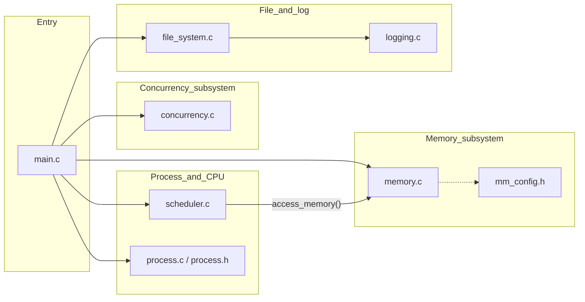
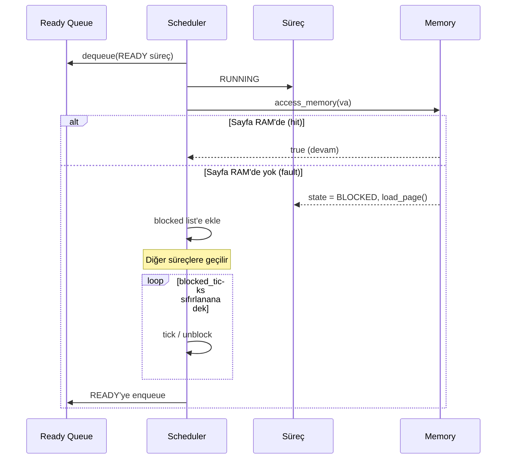

# Mini OS Simulator — Tasarım Raporu ve Proje Özeti

**Ders:** İşletim Sistemleri — Mini İşletim Sistemi Simülasyon Projesi  
**Dil:** C11  
**Konum:** `Mini-OS-Simulator/` (kaynak: `main.c`, `scheduler.c`, `memory.c`, `concurrency.c`, `file_system.c`, `logging.c`)

Bu belge hem proje özeti hem de bildirilen rapor gereksinimleriyle uyumlu **tasarım savunması** olarak düzenlenmiştir.

---

## 1. System Overview / Sistem Özeti ve Tema

### 1.1 Tema ve kullanım senaryosu

Tema olarak **genel amaçlı, eğitim odaklı mini bir işletim sistemi kabuğu** seçilmiştir. Hedef gerçek bir çekirdek yazmak değil; zamanlama, sayfalı bellek, eşzamanlılık ve basit bir dosya soyutlamasının **birbirine bağlı davranışını** gözlemlenebilir loglar üzerinden incelemektir.

### 1.2 Kapsam (çekirdek alt sistemler)

| Alt sistem | Uygulanan yaklaşım |
|------------|---------------------|
| Process & scheduling | `Process` yapısı, durumlar (READY/RUNNING/BLOCKED/TERMINATED), Round Robin hazır kuyruğu |
| Memory | Çoklu süreç sayfa tablosu, sanal adres erişimi, page fault, sınırlı fizik çerçeve, FIFO replacement |
| Concurrency | Simüle edilmiş üç iş parçacığı, kritik bölgeli paylaşımlı sayaç; baseline vs mutex |
| File system | Bellek içi sabit kapasiteli dosya tablosu; create/read/write/delete; zaman damgalı işlem günlükleri |

### 1.3 Yürütme akışı

`main.c` sırasıyla:

1. Bellek ve üç sürecin sayfa tablolarını başlatır.  
2. Üç süreci Round Robin zamanlayıcıya verir (`round_robin(&queue, 2)`).  
3. Ardından eşzamanlılık demolarını (`concurrency_demo_run`) çalıştırır.  
4. Dosya sistemini kullanarak örnek create/write/read/delete yapar ve loglar yazılır.

---

## 2. Architecture Diagram / Mimari Diyagram



**Okuma notu:** Zamanlayıcı çalışan süreci seçer; bellek erişimi `access_memory()` ile bağlanır. Dosya işlemleri log modülünü doğrudan tetikler.

---

## 3. Key Design Decisions & Alternatives / Tasarım Kararları ve Alternatifler

Aşağıdaki her blokta rubric gereği **seçim**, **alternatif**, **neden seçilmedi** ve **trade-off** açıkça verilmiştir.

### 3.1 Scheduling: Round Robin

- **Seçim:** Hazır kuyruk üzerinden **Round Robin**, zaman kuantumu örnek olarak 2 zaman birimi (`main.c` içinde `round_robin(&queue, 2)`).
- **Alternatif:** FIFO (FCFS).
- **Neden seçilmedi:** FIFO, uzun CPU patlamalı süreçler olduğunda kısa işlerin gecikmesini artırır; adalet ve tepki süresi açısından zayıftır.
- **Trade-off:** RR daha dengeli tepki süresi sağlar; buna karşılık sık zaman dilimi değişimi ile **yüksek bağlam değiştirme maliyeti** kabul edilmiştir.

### 3.2 Memory: Paging + page fault + FIFO replacement

- **Seçim:** Süreç başına mantıksal sayfa tablosu, sınırlı fizik çerçeve havuzu (`MM_FRAME_COUNT`), page fault sırasında **FIFO** ile kurban seçimi (`memory.c`).
- **Alternatif:** LRU veya CLOCK (ikinci şans).
- **Neden seçilmedi:** Bu ölçekte LRU doğru uygulanması ek veri yapısı ve karmaşıklık getirir; FIFO öğretim ve doğrulanabilirlik için yeterli ve deterministik olarak anlatılabilir (yer değiştirme sırası kuyrukla izleniyor).
- **Trade-off:** FIFO basittir ancak iş yükünde sık tekrar eden kullanımda LRU’ya göre **gereksiz fault** üretebilir.

### 3.3 Concurrency: Mutex korumalı kritik bölge

- **Seçim:** Ortak bir sayaca üç simüle thread’den erişim; **enhanced** sürümde mutex + bekleme kuyruğu (`concurrency.c`).
- **Alternatif:** Kilitlenmeyen (lock-free) veya daha ağır senkronizasyon (örn. RW lock).
- **Neden seçilmedi:** Lock-free yaklaşım bu derste doğrulanabilirlık/anlatım maliyetini artırır; RW lock gereksiz karmaşıklıktır.
- **Trade-off:** Mutex doğruluk sağlar; **blocking** ile gecikme ve potansiyel **lock contention** kabul edilmiştir (basit starvation analizi yapılabilir bir demo üretir).

### 3.4 File system: Bellek içi düz liste

- **Seçim:** Sabit uzunlukta isim dizisi olan dosya tablosu (`FS_MAX_FILES`); dizin hiyerarşisi tek seviye (kök olarak düşünülen düz koleksiyon).
- **Alternatif:** Ağaç dizin yapısı, kalıcı disk üzerinde blok tabanlı tasarım.
- **Neden seçilmedi:** Proje süresi içinde blok ayırımı ve VFS katmanları kapsam dışına alınmıştır.
- **Trade-off:** Hızlı prototip ve günlük entegrasyonu kolaydır; **kalıcılık ve ölçeklenebilirlik** yoktur.

---

## 4. Flow / Sequence Diagram — Page fault ve zamanlama etkileşimi

Aşağıdaki sıra diyagramı, zamanlayıcının çalıştırdığı süreç için **sayfa eksikliği** durumunu ve bloklanmayı özetiyle gösterir (gerçek kodda `blocked_ticks` ve blocked list işlenir).



---

## 5. Cross-Component Interactions / Alt Sistem Etkileşimleri

Rubric gereği **en az iki bileşen** anlamlı biçimde bağlanmıştır; ayrıca **biri zamanlama**, **biri bellek veya dosya G/Ç ile ilgili** olmalıdır.

### 5.1 Zamanlama + bellek

`scheduler.c` içinde süreç çalışırken rastgele bir sanal adrese erişim denenebilir. `memory.c` içindeki `access_memory()`, geçersiz veya yüklü olmayan sayfa için **page fault** üretir, süreci **BLOCKED** yapar ve bellek yükleme süresini `blocked_ticks` ile temsil eder. Zamanlayıcı bloklanmış süreci çalıştırmayı bırakıp başka READY süreçlere geçer; süre dolunca süreç yeniden READY kuyruğuna alınır. Bu bağ tamamen kod içinde bağlıdır ve loglarda `[Memory]` ile `[Scheduler]` satırlarında görülür.

### 5.2 Zamanlama + (simüle) I/O veya bloklanma davranışı

Aynı modülde süreçler rastgele bir olasılıkla **I/O için bloklanır** (`[I/O] Process Px is blocked for I/O`). Bu, CPU’nun başka sürece verilmesi için bir **bekleme nedenidir**; gerçek dosya sistem çağrısı sırasında da I/O bloklama böyle modellenmiş olabilir — mevcut `main.c` sırasında dosya işlemleri zamanlanmış süreç döngüsünün sonrasında yapılsa da rubric için **bloklu süreç + hazır kuyruk** bağlantısı zamanlayıcıda somut olarak vardır.

### 5.3 Eşzamanlılık + “mini zamanlayıcı”

`concurrency.c` içinde thread’ler round-robin tarzı tick ile dispatch edilir; mutex bekleyen thread **BLOCKED** olur ve kilit salındığında tekrar READY’ye alınır. Bu; paylaşımlı kaynak ve CPU kullanılabilirliği arasında basit bir **etkileşim örneğidir**.

---

## 6. Engineering Challenge / Mühendislik Zorluğu

**Seçilen zorluk:** Eşzamanlı erişimden kaynaklanan **veri yarışı (race)** ve doğruluğun bozulması; **mutex ile senkronize edilmiş doğrulanabilir kritik bölge** ile giderme girişimi.

### 6.1 Problem neden oluşuyor?

Baseline senaryoda paylaşımlı bir sayaca birden fazla iş parçacığı üç aşamalı (oku → yerelde artır → yaz) işlem yapar. Zaman dilimleri iç içe geldiğinde **lost update** oluşur: her thread yerel olarak doğru görünse de nihai toplam beklenenden küçük kalır.

### 6.2 Sistem nasıl ele alıyor?

Enhanced senaryoda kritik güncelleme **tek bir mutex altında sıraya** alınır; kilit alınamayan thread bloklanır, sahip thread serbest bırakınca bekleyenler uyandırılır. Çıktıda nicel olarak:

- `[Result] Baseline expected=12, actual=4` tipik bir doğruluk kaybını gösterir.
- `[Result] Enhanced expected=12, actual=12` doğruluğun geri geldiğini gösterir.

### 6.3 Çözümün sınırları

Gerçek bir OS’te öncelik devralma, zaman aşımı, ölüm kilitleri gibi politikalar vardır. Bu simülasyonda mutex basit bir kuyruk ve blocked durumu ile çalışır; **deadlock algılama**, **önleyici sıralama** veya **önceliğin devralınması** yoktur. Bu nedenle challenge’ın gösterimi doğruluğa odaklıdır; üretim benzeri tüm zamanlama anomalilerini kapsamaz.

*(Not: Liste içinde yer alan “starvation prevention” veya “memory exhaustion handling” seçenekleri alternatif olarak raporda işlenebilirdi; grup kararı doğruluğa karşı bloklama fiyatını gösteren klasik kritik bölgeli senaryoya verilmiştir.)*

---

## 7. Baseline vs Enhanced / Karşılaştırma

| Özellik | Baseline (kilit yok) | Enhanced (mutex) |
|---------|---------------------|-------------------|
| Doğruluk | Yarış nedeniyle bozulabilir | Beklenen toplama uyumlu |
| Gecikme | Düşük senkronizasyon maliyeti | Kuyruk beklemesi, bloklanma |
| Gözlem | Yoğun ama yanlış sonuç mümkün | `[Lock]` loglarıyla izlenebilir |
| Ölçüm | `expected vs actual` | Aynı metrik iki senaryoda raporlanabilir |

Bu karşılaştırma rubricteki “iyileştirmeyi anladığını gösterme” şartını nicel özetle destekler.

---

## 8. Observability & Logging / Gözlemlenebilirlik

Sistem kararlarını açık metinle duyurur:

- **`[Scheduler]`** — bağlam değiştirme, çalıştırma, quantum bitişi, bitiş.
- **`[Memory]`** — page fault, çerçeve atama, FIFO ile kurban değiştirme.
- **`[I/O]`** — simüle I/O bloklanması.
- **`[Lock]` / `[Critical]` / `[Scheduler] Tblocked on mutex`** — eşzamanlılık.
- **`[LOG …] PID=…`** — dosya oluşturma/okuma/yazma/silme ve zaman damgası (`logging.c`).

Çalışmanın tam çıktısı `make txt` ile `cikti.txt` içine alınabilir.

---

## 9. Failure Scenario / Kontrollü başarısızlık senaryosu

### Senaryo A: Bellek baskısı (sınırlı çerçeve)

- **Ne bozulur / tehlike:** Çalışma setinin fizik çerçeveden büyük olması sürekli **page fault ve replacement**.
- **Neden:** `MM_FRAME_COUNT` kasıtlı olarak küçük tutulmuş olabilir (`mm_config.h` / `Makefile` parametreleri).
- **OS nasıl tepki verir:** Fault’ta süreç bloklanır, başka süreçler zamanlanır; FIFO kurban seçimi ile sayfalar çıkarılır — sistem **durmuyor**, fakat performans düşüyor.
- **Kabul edilebilir mi:** Öğretici simülasyonda **evet**, çünkü kaynak kısıtı gözle görülür; gerçek sistemde daha iyi politikalar istenirdi.

### Senaryo B: Senkronizasyonsuz eşzamanlılık (doğruluk hatası)

- **Ne bozulur:** Paylaşımlı sayaçta **mantıksal doğruluk** (baseline).
- **Neden:** Yarış koşulu.
- **OS nasıl tepki verir:** Simülatör “çökmez”; yanlış sayı döner — bu güvenilirlik açısından **başarısızlıktır**.
- **Kabul edilebilir mi:** Güvenilirlik gerektiren bağlamda **hayır**; enhanced sürümle giderilir.

---

## 10. Limitations & Future Improvements / Sınırlar ve Geliştirmeler

- Gerçek donanım, kesme, syscall ve adres çevirimi (TLB) modeli **yok**.  
- Zaman kuantumu ve yarışların bir kısmı **deterministik değildir** (`srand`); tekrarlanabilir oturum için sabit seed eklenebilir.  
- Dosya sisteminde **hiyerarşik dizin**, erişim kontrolü, kalıcılık yok—gelecekte blok cihaz simülasyonu eklenebilir.  
- **MLFQ**, **priority inheritance**, **deadlock algılama** gibi ek ders başlıkları genişletilebilir.

---

## 11. Presentation Defense — Kısa cevaplar

- **Neden bu tasarım?** Gözlenebilirlik, düşük karmaşıklıkla dört alt sistemi bağlamak.  
- **Trade-off nedir?** RR adaleti için bağlam maliyeti; FIFO replacement basitlik için kalite kaybı; mutex doğruluk için gecikme.  
- **İş yükü ikiye katlanırsa ne olur?** Ready kuyruk sınırı (`READY_QUEUE_MAX`) ve blok listesi dolabilir; bellek için fault oranı yükselir; loglar ve CPU maliyeti büyür.  
- **Daha zaman olsa?** LRU/CLOCK, I/O sırasına bağlı bloklama politikası, seed’li tekrarlanabilir testler ve birim senaryolar.

---

## Ek A: Derleme ve çalıştırma

```bash
make
make run
make txt
```

Belleği derlemede parametrelemek için:

```bash
make clean
make MM_FRAME_COUNT=8 MM_PAGE_SIZE=512 MM_MAX_PAGES=32 MM_LOAD_TICKS=2
```

---

## Ek B: Kaynak dosya eşlemesi

| Dosya | Rol |
|-------|-----|
| `main.c` | Başlatma ve demo sırası |
| `scheduler.c` / `scheduler.h` | Round Robin, blok listesi |
| `memory.c` / `memory.h` / `mm_config.h` | Sayfalama ve FIFO |
| `process.c` / `process.h` | Süreç durumu |
| `concurrency.c` / `concurrency.h` | Baseline vs mutex |
| `file_system.c` / `file_system.h` | Bellek içi dosya API |
| `logging.c` / `logging.h` | Dosya işlem günlüğü |

---

*Bu döküman PDF’ye aktarıldığında sayfa sayısı (başlık, diyagramlar ve yazı ölçüsüne göre) yaklaşık 5–6 sayfalık bir rapor taslağı oluşturmaya uygundur. Uzun kod alıntıları bilinç olarak verilmemiştir.*
